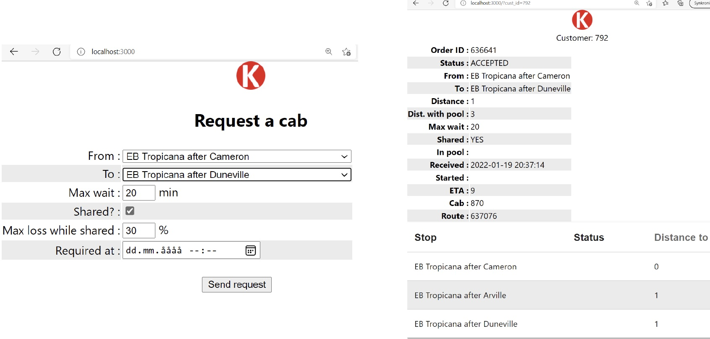
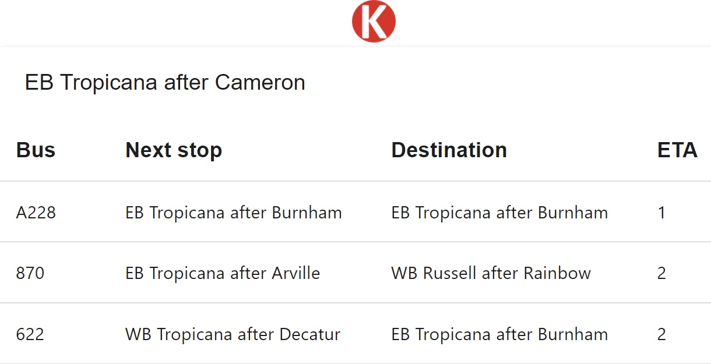
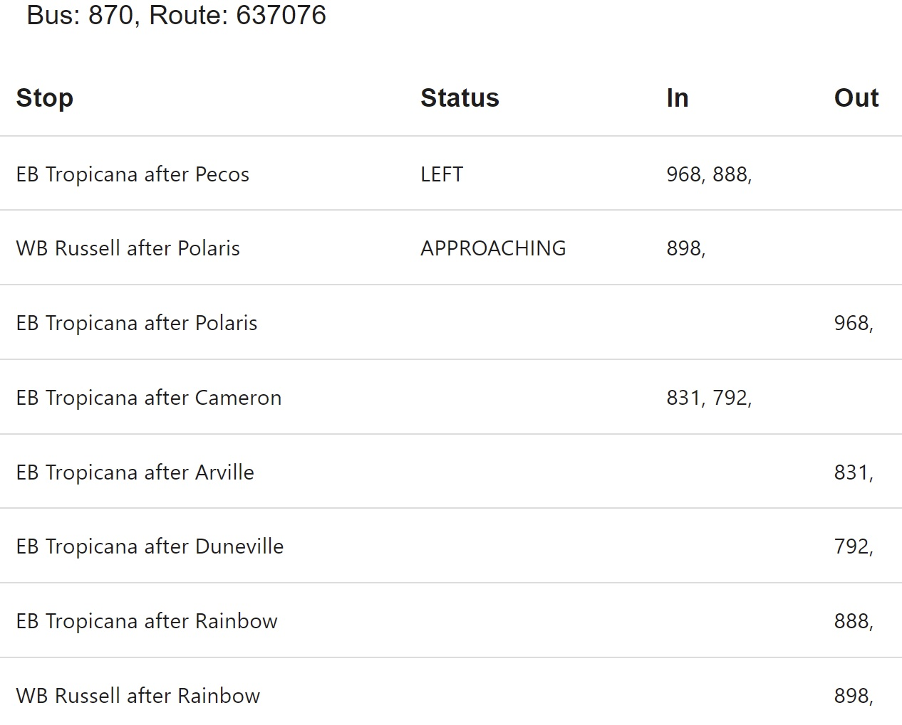
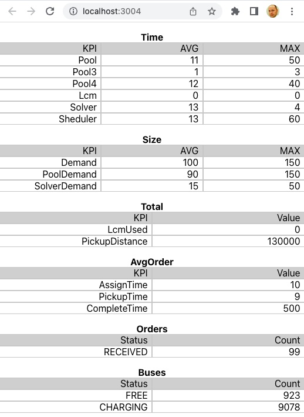
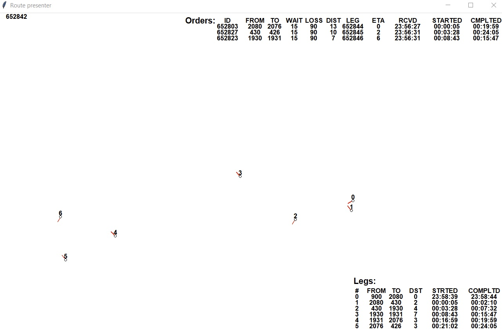

# How to run a simulation
In order to test the dispatcher you can run a simulation. You need at least three components:
* [Kern](https://gitlab.com/kabina/kapir): dispatcher
* [Kim](https://gitlab.com/kabina/kim): client simulator, which emulates real users in big volume (100k/h) with direct insertion into database.
The results will be saved in the database and logs.

To test the technology stack more realistically you can simulate clients via RestAPI, without Kim:
* [Kapir](https://gitlab.com/kabina/kapir): Rest API responsible for receiving requests, share statuses and store them in a database
* [Kapi](https://gitlab.com/kabina/kapi/client): Rest API client simulator, which also emulates real users in big volume (100k/h)

But you might also want to test visually, on-line, how a request is served. Four React applications will help you do it: 
* [Kabina](https://gitlab.com/kabina/kabina): mobile application for customers 
* [Kab](https://gitlab.com/kabina/kab): mobile application for minibus drivers
* [Kavla](https://gitlab.com/kabina/kavla): mobile application for presenting current routes serving a bus stop 
* [Kanal](https://gitlab.com/kabina/kanal): some performance indicators of the dispatcher.

## Prerequisites:
* PostgreSQL
* C compiler (optional, implementation of pool in Rust exists)
* Rust compiler
* Go compiler (alternativelly a [Java client](https://gitlab.com/kabina/kaboot/-/tree/master/generators/src) exists, but it is slow and resource-hungry)
* Node.js (optional, React apps for single customer)
* Python (optional, to watch KPIs and for route quality check; python-tk and psycopg2-binary needed)

Java and C# implementations of these components (dispatcher, RestAPI and clients) exist, but they are not maintained any longer. Java was a proof-of-concept, C# was used for benchmarking (not good either).

## How to install and run

### Kern

1) Compile the pool finder (optional, see use_extern_pool below) and make the library available for Rust compiler, an example for Mac OS:
   ```
   cd pool
   cc -c -Wno-implicit-function-declaration poold.c dynapool.c -w
   ar -cvq libdynapool.a poold.o dynapool.o
   sudo cp libdynapool.a /Library/Developer/CommandLineTools/SDKs/MacOSX11.1.sdk/usr/lib/
   ```

2) check the source code if proper name of library is used, during testing different versions may be used, an example for libdynapool88.a
   ```
   #[link(name = "dynapool88")] 
   ```
3) Compile the dispatcher
   ```
   cargo build --release 
   ```
4) Create DB schema
We assume that DB schema and user have been created beforehand, here 'kabina':
   ```
   cd sql
   psql -U kabina kabina < create.sql
   psql -U kabina -c "COPY stop(id, no, name, latitude, longitude, bearing) FROM 'stops-Budapest-import.csv' DELIMITER ',' CSV HEADER ENCODING 'UTF8';"
   ```
This will create example stop, cab and customer entities. 

5) Edit config file <em>kern.toml</em>
   
  | Parameter | Purpose
  |----------|--------
  | db_conn | database connection string - user, password, address, port, schema
  | run_after | time difference in seconds between dispatcher executions
  | solver_interval | how often solver is engaged, 4 means every fourth lap. The idea is to wait for more requests, maybe some of them will allow for a pool
  | max_assign_time | time in minutes after which orders expire
  | max_solver_size | if demand and supply exceed the value LCM will be called to shrink the model
  | max_legs | how many legs can a route have, used in route extender
  | max_angle | max angle between consecutive stops; used to promote streight routes 
  | cab_speed | average speed in km/h
  | stop_wait | how many minutes it takes at a stop
  | log_file  | log file location and name
  | use_pool | if pool finder should be used
  | use_extern_pool | if external pool finder (C library) should be used
  | use_extender | if route extender should be used
  | thread_numb | how many threads should be used
  | max_pool4_size | max allowed size of demand for pools with 4 passengers (for tuning, depends on hardware performance)
  | max_pool3_size | max allowed size of demand for pools with 3 passengers
  | max_pool2_size | max allowed size of demand for pools with 2 passengers

1) Scheduler can be started with `target/release/kern` or `cargo run --release`
Though nothing will happen until cabs will report their availability and customers will submit their trip requests, e.g. with [Kim](https://gitlab.com/kabina/kim) or via RestAPI. 

### Kim

1) Make changes in *kim.toml*:
   
  | Parameter | Purpose
  |----------|--------
  | db_conn | database connection string - user, password, address, port, schema
  | log_file | both buses and passengers will be logged here
  | cab_speed | km/h, how fast does a bus drive between stops
  | max_time | duration of request submission in minutes, simulation will take longer to complete
  | check_interval | sleep duration between iterations, which submit requests and updates both buses and passengers
  | max_cab | how many buses should be emulated. there must be rows in database for them
  | max_stand | id of the last stop in the database
  | stop_wait | how long should a bus wait at a stop, in seconds
  | req_per_min | how many trips per minute should be requested
  | max_wait_for_assign  | after how many minutes of waiting for assignment should a passenger cancel a request
  |  max_delay | after what delay beyond max_wait (no bus has appeared to pick up the passenger) should a passenger cancel a request, in minutes
  |  max_trip | max duration of a trip requested, in minutes
  | max_detour | in percents, what extension of max_trip can a passenger accept in a pool (in exchange for a better price?)
  | max_trip_actual | not used
  | max_trip_delay | delay of the whole trip including detour that will cause a warning in log if exceeded, in minutes 
 
1) Run
   ```
   cargo run --release
   ```

### Kapir

1) Make changes in *kapir.toml* (myhost is where API binds to, helps with serving external requests).
2) Run
   ```
   ulimit -n 100000
   cargo run --release
   ```
The *ulimit* command helps under heavy load, number has to be adjusted to needs. 

### Kapi client
Kapi is alse a Rest API written in Go but we will need only the client
1) cd client
2) adjust the host of RestAPI server in util.go
   ```
   var host string = "http://localhost:8080"
   ```
3) adjust simulation parameters
   see constants in main.go. You should not have more REQ_PER_MIN than 100 if you run all components on one machine.

4) build
   ```
   go build
   ```
5) run cabs
   You should run it first and wait a minute so that cabs manage to update their availability.
   ```
   ./kabina cab
   ```

6) run customers
   ```
   ./kabina
   ```
### React clients
1) install
   ```
   npm install
   ```
2) adjust RestAPI address
   find "localhost:8080" in the code (a TSX file) and replace with your own configuration
3) run
   ```
   npm start
   ```

## How to use React clients
Kapi client will use customer IDs starting with 1. You can use 0 as your test ID (you can check in database if it exists with `select id from customer where id=0`). If you have started all React apps you can request a trip with `http://localhost:3000/?cust_id=0`.

`http://localhost:3000/?cab_id=1`

You can watch incoming buses at a chosen stop (stop ID precedes name of the stop in Kabina):
`http://localhost:3001/?stop_id=1234`


When you get assigned a cab you can watch driver's route with (cab's id is shown in Kabina):
`http://localhost:3002/?cab_id=123`

You can follow the outcome of simulation (number of cabs assigned, customers with different statuses, performance of the dispatcher) at `http://localhost:3004/`


## Python scripts

### Dump of KPIs
This can be interesting how performance indicators have changed through out simulation in order to identify load peaks. You can dump metrics with a Python script, which you can find in Kern module in `py` subdirectory:
```
python3 stats-postgres.py
```  
Three files will be dumped with kpis and statuses of cabs and customers. Verify 'host' value before you run it.

### Route check
You can verify routes visually (no cycles? are they reasonable?) with another Python script. Check 'host' value in the file:
```
python3 show-routes.py
``` 

You might need to install two librarites first with 
```
brew install python-tk
pip3 install psycopg2-binary
```
Use arrows down and up to navigate through routes:

Red lines indicate headings of bus stops, they should not deviate much (see 'max_angle' in `kern.toml`).

## How to rerun
One has to clean up some tables to run a simulation again:
```
update cab set status=2;
update stat set int_val=0;
delete from taxi_order;
delete from leg;
delete from route;
```
You would like to remove previous logs:
1. Kern: `rm log/*`
2. Kapir: `rm kapi.log`
3. Kapi: `rm client/*.log`

## Copyright notice

Copyright 2022 Bogusz Jelinski

Licensed under the Apache License, Version 2.0 (the "License");
you may not use this file except in compliance with the License.
You may obtain a copy of the License at

     http://www.apache.org/licenses/LICENSE-2.0

Unless required by applicable law or agreed to in writing, software
distributed under the License is distributed on an "AS IS" BASIS,
WITHOUT WARRANTIES OR CONDITIONS OF ANY KIND, either express or implied.
See the License for the specific language governing permissions and
limitations under the License.
#
Bogusz Jelinski    
December 2023
Mo i Rana

bogusz.jelinski (at) g m a i l